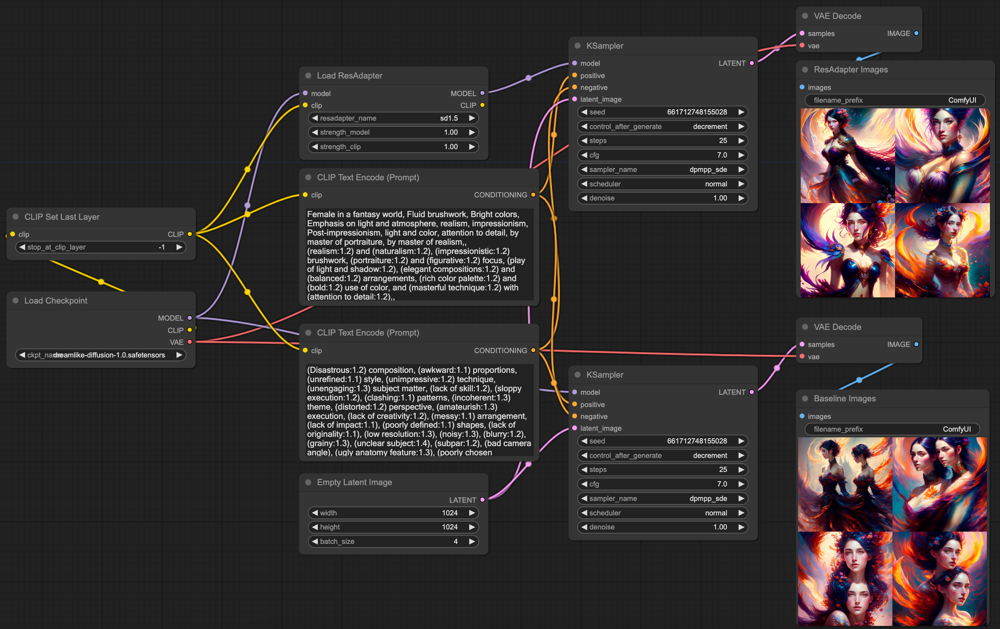

# ResAdapter for ComfyUI

We provide ComfyUI-ResAdapter node to help users to use ResAdapter in ComfyUI.

⭐ If ResAdapter is helpful to your images or projects, please help star this repo and [bytedance/res-adapter](https://github.com/bytedance/res-adapter). Thanks! 🤗

## Installation

```bash 
# Step1: Clone ComfyUI-ResAdapter
git clone git@github.com:jiaxiangc/ComfyUI-ResAdapter.git

# Step2: Move it to ComfyUI/custom_nodes
mv ComfyUI-ResAdapter ComfyUI/custom_nodes/

# Step3: Select Load ResAdapter Node in ComfyUI. We can use it like LoRA Loader.
```

## Download Model

We provide script for automatically downloading resadapter model from huggingface in `__init__.py`. If you can not connect with [huggingface.com](https://huggingface.co/), you can directly download model in [huggingface](https://huggingface.co/jiaxiangc/res-adapter). 

## Examples

Here we provide the [resadapter workflow](resadapter-workflow.json), which is an example about `resadapter_v1_sdv15` with [dreamlike-diffusion-1.0](https://huggingface.co/dreamlike-art/dreamlike-diffusion-1.0).

We also provide a demo video for helping users to know how to use ComfyUI-ResAdapter, which is supported by [@fengyuzz](https://github.com/fengyuzzz).

https://github.com/jiaxiangc/ComfyUI-ResAdapter/assets/162297627/adc6ec6d-bc43-4ecc-9d3a-2b3c31aeef6c




