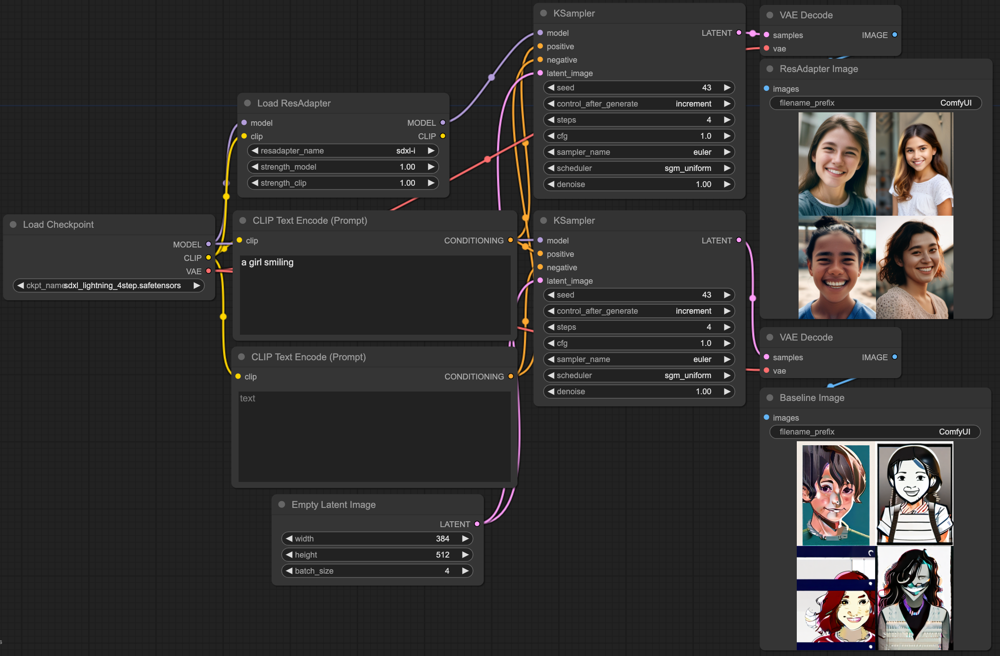

<h1> ResAdapter for ComfyUI </h1>

ResAdapter github link: https://github.com/bytedance/res-adapter

🔥 We are pleased to announce that [ComfyUI-ResAdapter](https://github.com/jiaxiangc/ComfyUI-ResAdapter) is complete and users can install it to load the weights of ResAdapter.

🧊 However, due to the internal arrangement of our company, we will postpone open-sourcing the code of ComfyUI-ResAdapter for some time. We will open source it as soon as possible, please be patient.

## Examples

**ResAdapter with SDXL-Lightning**

**ResAdapter with Dreamlike-Diffusion-1.0**

